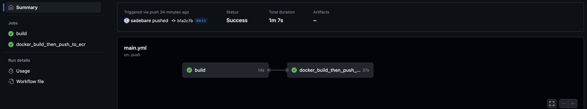
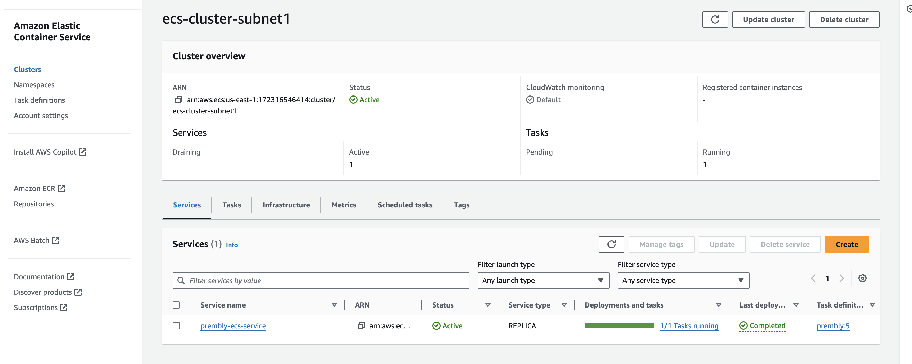
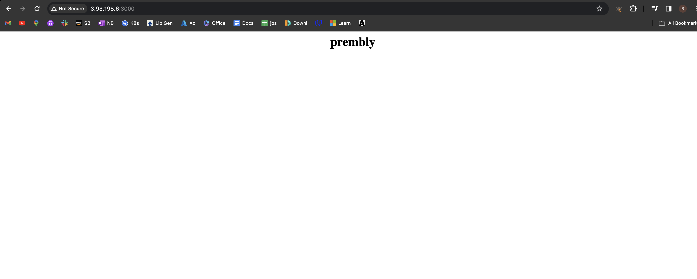
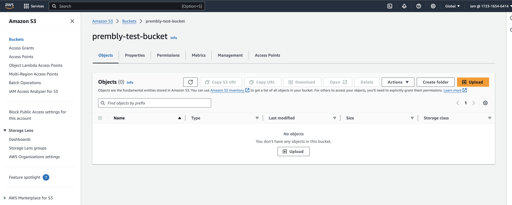
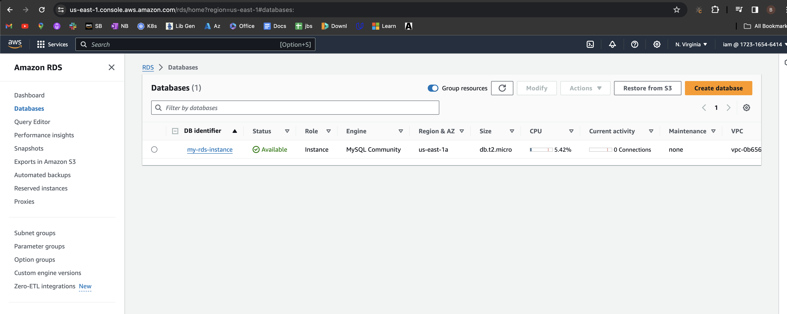

# Task 1: Docker and Containerization

## Overview

This repository contains the Docker Compose setup and configuration for a microservices-based application. Each microservice is packaged in a Docker container, enabling efficient deployment and scalability.

## A - Docker Compose Setup

### Services Overview

 **Simple typescript Web Application Service**
   - **Service Name:** `prembly-web-app-service`
   - **Description:** Hosts the web application of the microservice.
   - **Attached with the docker-compose file is a single network called servicenetwork, if we have multiple microservices, we can attach the network, with that they communicate.**
   - **We then build the image itself using the command:**

            docker build -t repo_name/image_name .

   - **Also, we can spin up the service using the docker-compose command as thus:**

            docker-compose up -d
    
   -   **NB: The application starts up at port 3000**

### Configuration

The [`docker-compose.yml`](./docker-compose.yml) file defines the infrastructure for the microservice for testing on local machine by the developers

## B -  Multi-Stage Dockerfile
 **Optimized Dockerfile**
   - For the microservice, a multi-stage Dockerfile has been created to optimize the size of the final image. This ensures efficient resource utilization and faster deployment. [Here](./Dockerfile)

# Task 2: CI/CD and Version Control
## Overview

I utilized the GitHub action for the CI/CD for seamless integration and to demonstrate the workflow in a more visual format. Also, since am hosting my codebase on GitHub, it makes it easier to set up and work on.
## A - GitHub Action pipeline
**Pipeline for building, starting, dockerizing and pushing to Elastic Container Registry (ECR)**
    -   For this, i made sure the application builds and starts properly before dockerizing and pushing to ECR. The buildng of the app to docker image solely depend on application running and starting properly
     
## B - Versioning Strategy
-   Using the versioning strateegy, i have made the docker image to have two tags (latest and a random value), in any occurence where we need to roll back to previous image, we can use the random value tag because the latest tag will be replaced each time we push to ECR.

## C - Git Hooks
 -   This is been implemented anytime there is a **push** to the repo, it then trigger the pipeline to start running.


    on:
    push:
        branches:
        - main

# Task 3: Infrastructure as Code (IaC)
# Terraform Setup

This repository contains Terraform scripts to provision AWS resources. The scripts are organized to achieve the following tasks:

## A- Terraform Setup

### 1. Create VPC, Subnets, and ECS cluster, ECS service and deployed the application to ECS Service

#### Prerequisites
- [Terraform](https://www.terraform.io/downloads.html) installed on your machine.
- AWS credentials configured with appropriate permissions.

#### Steps

1. Clone this repository:
   ```bash
   git clone https://github.com/sadebare/prem.git
   cd terraform

2. Initialize Terraform:
   ```bash
    terraform init

3. Plan Terraform:
   ```bash
    terraform plan

4. Adjust variables if needed:
    Edit **variables.tf** to provide specific values for your environment.

5. Execute the Terraform script which create resources in AWS:
   ```bash
    terraform apply





## B - Extend the Terraform script to provision an S3 bucket and an RDS instance

-   Executing the terraform script also create S3 bucket and RDS instance (SQL). The RDS instance is been created in the private subnet not having access to the internet, we can only access it from the VPC.




- Run **terraform destroy** to destroy and take down all resources on AWS

# Task 4: Monitoring and Logging
- In my setup, i utilized the aws cloudwatch logs for the logging and also cloud watch to monitor the resouces such as CPU utilization, memory utilization and other in our environment.


# Task 5: Scripting and Automation
-   Tasks for installing, configuring, and starting Nginx using Ansible is found [here](./ansible-script/nginx_setup.yaml) and can be run with the command:

   ```bash
    cd ansible-script
    ansible-playbook nginx_setup.yaml